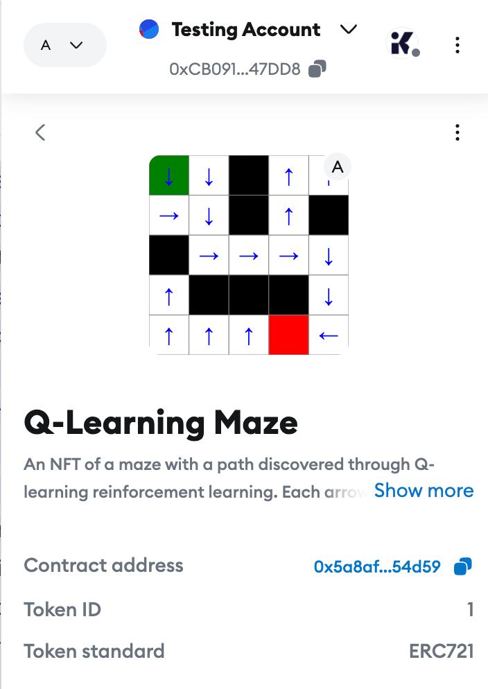
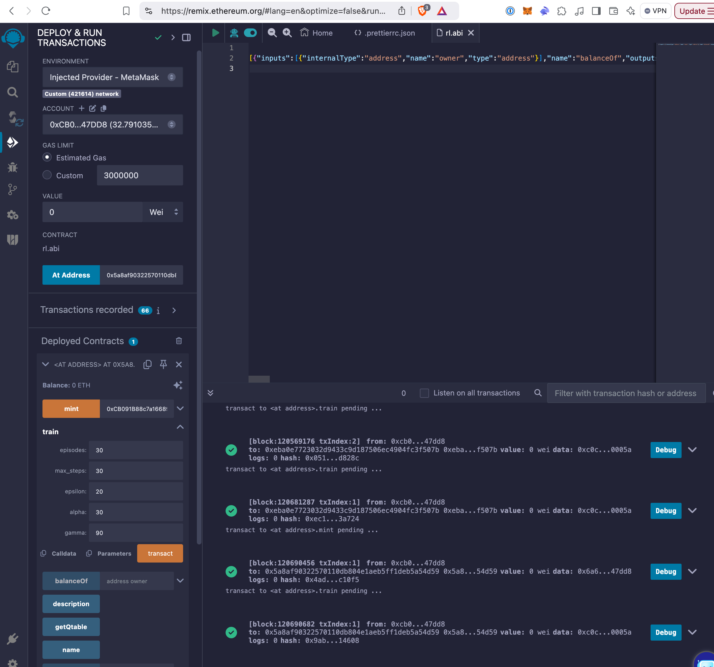

# Q-Learning Maze NFT Workshop

This repository demonstrates how to implement AI agents that execute directly on-chain using Arbitrum Stylus. The project was created as part of the ETHGlobal Agenttic Ethereum Hackathon, showcasing the potential of running AI algorithms directly within smart contracts.

## Why On-Chain AI?

While most current AI integrations with blockchain involve off-chain computation (typically using large language models) followed by on-chain actions, this project demonstrates a different approach: implementing the AI agent to run entirely on-chain. This opens up new possibilities for:

- DEX hooks that analyze market conditions in real-time
- Dynamic risk scoring for lending protocols
- Price prediction mechanisms
- Automated decision-making based on on-chain metrics

Our example uses Q-learning, a classic reinforcement learning algorithm, to demonstrate how an AI agent can learn and adapt within the constraints of a smart contract environment.

## Overview

The smart contract implements a 5x5 maze where:
- A Q-learning algorithm learns the optimal path from start to goal
- The maze solution is visualized as an NFT using SVG
- Each cell shows an arrow pointing to the next best move
- The contract implements the ERC-721 standard for NFT compatibility


*Screenshot of the maze NFT displayed in MetaMask*

## Setup

1. First, set up your Rust and Stylus environment by following the [Arbitrum Stylus Getting Started Guide](https://docs.arbitrum.io/stylus/gentle-introduction)

2. Clone this repository:
```bash
git clone https://github.com/hammertoe/ArbitrumOnchainAgent
cd ArbitrumOnchainAgent
```

## Deployment

1. First, check that your contract compiles correctly:
```bash
cargo stylus check -e https://sepolia-rollup.arbitrum.io/rpc
```

2. Deploy the contract (replace `${PRIVATE_KEY}` with your private key):
```bash
cargo stylus deploy -e https://sepolia-rollup.arbitrum.io/rpc --private-key ${PRIVATE_KEY} --no-verify
```

3. Export the ABI for use with Remix:
```bash
cargo stylus export-abi --json --output contract.abi
```

## Interacting with the Contract

Once deployed, you can interact with the contract using Remix:

1. Import the ABI into Remix
2. Connect to the deployed contract address
3. Train the Q-learning algorithm using the `train` function
4. Mint your NFT using the `mint` function
5. View the learned path in your wallet!


*Screenshot of interacting with the contract in Remix*

## Contract Functions

- `mint(address)`: Mint the NFT to a specified address
- `train(episodes, max_steps, epsilon, alpha, gamma)`: Train the Q-learning algorithm
- `token_uri()`: Generate the SVG visualization of the maze
- Standard ERC-721 functions for NFT compatibility

## Technical Implementation

This project uses Q-learning, a reinforcement learning algorithm, to solve a maze puzzle. The agent:
1. Learns through trial and error
2. Develops an optimal policy for navigating the maze
3. Visualizes its learned solution as an NFT
4. Runs entirely on-chain using Arbitrum Stylus

## Workshop Context

This project was developed for a workshop during the ETHGlobal Agenttic Ethereum Hackathon, where Arbitrum was a sponsor offering $10,000 in prizes for innovative projects built on Arbitrum. The workshop demonstrates how Arbitrum Stylus enables running sophisticated algorithms, including AI agents, directly on-chain.

Watch the full workshop recording [here](https://www.youtube.com/live/vdVVviYdspc) to learn about:
- The potential of on-chain AI agents
- Implementing reinforcement learning in smart contracts
- Using Arbitrum Stylus for complex on-chain computation
- Creating interactive NFTs that showcase AI behavior

## Contributing

Feel free to submit issues and enhancement requests!

## License

MIT License - See LICENSE file for details

---

Note: Replace placeholder image paths with actual screenshots once available. Update the repository URLs as needed.